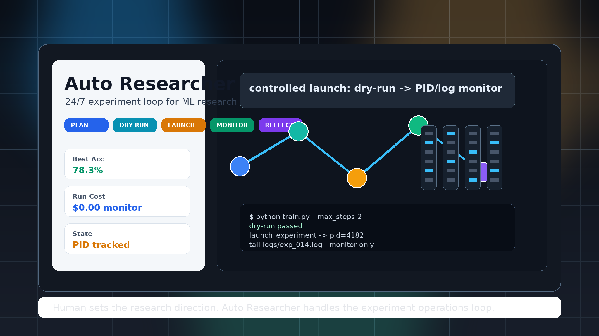
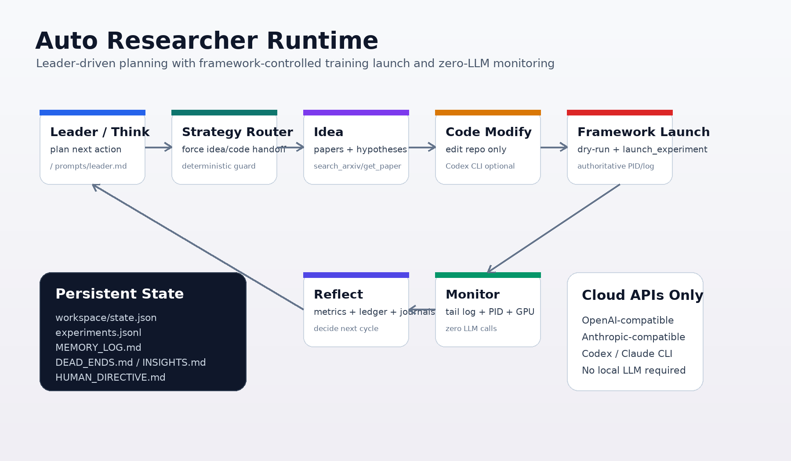

# Auto Researcher

<p align="center">
  
</p>

<p align="center">
  <strong>一个由 Codex CLI 驱动的长时间深度学习实验控制器。</strong>
</p>

<p align="center">
  <a href="../README.md">English</a> |
  <a href="README_CN.md">中文</a>
</p>

<p align="center">
  <a href="#安装">安装</a> |
  <a href="#快速开始">快速开始</a> |
  <a href="#配置">配置</a> |
  <a href="#工作机制">工作机制</a>
</p>

<p align="center">
  
  
  
</p>

---

## 这是什么

Auto Researcher 不是一个独立模型，也不只是提示词集合。它是围绕 **Codex CLI** 构建的自主实验控制器：

1. 读取研究 brief 和当前实验状态。
2. 让 Codex CLI 检查并修改代码库。
3. 运行强制 dry-run。
4. 由 Auto Researcher 启动训练，而不是让 Codex 直接启动训练。
5. 用零 LLM 调用监控 PID、日志和 GPU 状态。
6. 反思结果，更新记忆和实验账本，然后继续下一轮。

核心边界很明确：**Codex 负责写代码；Auto Researcher 负责启动和监控训练。** 这样长时间训练任务会有可追踪的 PID 和日志路径，而不是藏在某个 agent 会话里。

## 安装

### 1. 安装 Codex CLI

推荐工作流依赖 Codex CLI。请先安装并登录 Codex CLI。

macOS 或 Linux：

```bash
curl -fsSL https://chatgpt.com/codex/install.sh | sh
```

也可以用：

```bash
npm install -g @openai/codex
brew install --cask codex
```

登录。运行 `codex` 会进入正常交互流程；当前版本也支持 `codex login`：

```bash
codex login
```

验证：

```bash
codex --version
```

### 2. 安装 Auto Researcher

```bash
git clone https://github.com/shaopengDaJiDaLi/auto_researcher.git
cd auto_researcher

python -m venv .venv
source .venv/bin/activate
pip install -r requirements.txt

python install.py
python -m auto_researcher.runner --check
```

`python install.py` 会安装本地 Codex skills，包括 `$auto-research`。

## 快速开始

创建一个实验项目：

```bash
mkdir -p ~/my_experiment
cd ~/my_experiment
```

编写 `PROJECT_BRIEF.md`：

```markdown
# 目标
训练一个 CIFAR-100 分类器，达到 80%+ top-1 accuracy。

# 代码库
在这个项目里创建或修改 PyTorch 训练代码。

# 约束
- 只使用 GPU 0
- 长训练前必须 dry-run
- 日志写到 ./logs/
- 每次训练后报告验证准确率

# 决策规则
- 如果准确率低于 75%，优先改进优化策略。
- 如果准确率在 75-80%，尝试数据增强。
- 如果准确率达到 80%，停止并写报告。
```

添加最小配置：

```yaml
# ~/my_experiment/config.yaml
agent:
  provider: "codex_cli"
  model: "gpt-5.4"

  leader_provider: "codex_cli"
  reflect_provider: "codex_cli"
  code_modify_provider: "codex_cli"
  code_launch_provider: "builtin"

strategy:
  enabled: true
  require_dry_run: true
  dry_run_timeout: 300

execution:
  mode: "local"
```

从 Codex 启动：

```text
$auto-research --project ~/my_experiment --gpu 0
```

也可以直接从 Python 启动：

```bash
cd /path/to/auto_researcher
python -m auto_researcher.runner --project ~/my_experiment --gpu 0
```

测试时只跑少量循环：

```bash
python -m auto_researcher.runner \
  --project ~/my_experiment \
  --gpu 0 \
  --max-cycles 2
```

## 配置

默认配置在 [`config.yaml`](../config.yaml)。本项目推荐使用 Codex CLI 做推理和代码修改，同时让框架内置逻辑负责启动训练：

```yaml
agent:
  provider: "codex_cli"
  model: "gpt-5.4"

  leader_provider: "codex_cli"
  reflect_provider: "codex_cli"
  code_modify_provider: "codex_cli"
  code_launch_provider: "builtin"
```

为什么 `code_launch_provider: "builtin"` 很重要：

- Codex CLI 擅长读代码和改代码。
- 训练启动必须由 Auto Researcher 控制。
- Auto Researcher 会记录权威的 PID/job id 和日志路径。
- 监控阶段只读取进程状态、GPU 状态和日志尾部，不消耗 LLM 调用。

也可以让部分角色走云端 API，比如文献搜索或写作：

```yaml
agent:
  provider: "codex_cli"
  model: "gpt-5.4"

  leader_provider: "codex_cli"
  reflect_provider: "codex_cli"
  code_modify_provider: "codex_cli"
  code_launch_provider: "builtin"

  idea_provider: "openai"
  idea_model: "gpt-5.4"
  idea_api_key_env: "OPENAI_API_KEY"
  writing_provider: "openai"
  writing_model: "gpt-5.4"
  writing_api_key_env: "OPENAI_API_KEY"
```

支持的 provider 路径：

| Provider | 用途 |
|----------|------|
| `codex_cli` | 推荐用于代码修改和控制器推理 |
| `openai` | OpenAI-compatible API 调用 |
| `anthropic` | Anthropic-compatible API 调用 |
| `claude_cli` | 可选 Claude Code CLI 路径 |
| `deepseek`, `qwen`, `dashscope`, `kimi`, `moonshot`, `glm`, `zhipu` | OpenAI-compatible 预设 |

## 工作机制

<p align="center">
  
</p>

| 阶段 | 责任 |
|------|------|
| Think | 读取 `PROJECT_BRIEF.md`、记忆、账本、状态和人工指令 |
| Route | 为下一轮选择 `idea`、`code` 或 `writing` |
| Code Modify | Codex CLI 修改代码/配置，并返回启动 handoff |
| Dry Run | Auto Researcher 运行 dry-run 命令 |
| Launch | Auto Researcher 启动训练并记录 PID/日志路径 |
| Monitor | 轮询进程、GPU 和日志文件，零 LLM 调用 |
| Reflect | 解析指标，更新记忆、账本、insights 和 dead ends |

代码修改完成后，Codex 应返回类似这样的 handoff：

```json
{
  "status": "ready_to_launch",
  "changed_files": ["train.py", "configs/exp.yaml"],
  "dry_run_command": "python train.py --config configs/exp.yaml --max_steps 2",
  "launch_command": "python train.py --config configs/exp.yaml",
  "log_file": "logs/exp_001.log",
  "expected_duration": "8 hours"
}
```

Auto Researcher 会用这个 handoff 自己运行 dry-run 和 launch command。

## 项目状态

每个实验项目会在 `workspace/` 下保存持久状态：

```text
workspace/
├── MEMORY_LOG.md
├── experiments.jsonl
├── DEAD_ENDS.md
├── INSIGHTS.md
├── state.json
├── HUMAN_DIRECTIVE.md        # 可选，下一轮消费
└── progress_tracking/        # 本地 notes fallback
```

想改变下一轮方向：

```bash
echo "尝试 cosine warmup，并和上一次最佳结果对比" > workspace/HUMAN_DIRECTIVE.md
```

## 执行后端

本地执行：

```yaml
execution:
  mode: "local"
```

SSH 执行：

```yaml
execution:
  mode: "ssh"
  ssh_host: "user@server"
  remote_workspace: "/home/user/project/workspace"
```

Slurm 执行：

```yaml
execution:
  mode: "slurm"
  ssh_host: "user@login-node"
  remote_workspace: "/shared/project/workspace"
  slurm_partition: "gpu"
  slurm_time: "24:00:00"
  slurm_gpus_per_job: 1
```

无论哪种后端，Auto Researcher 都拥有 job id 或 PID 以及日志路径。

## Skills

`python install.py` 会安装 Codex local skills：

| Codex skill | 用途 |
|-------------|------|
| `$auto-research` | 启动或恢复自主实验循环 |
| `$experiment-status` | 检查状态、PID、日志、GPU 和账本 |
| `$gpu-monitor` | 检查 GPU 可用性 |
| `$daily-papers` | 获取 arXiv 推荐 |
| `$paper-analyze` | 分析论文 |
| `$conf-search` | 搜索会议论文 |
| `$progress-report` | 总结近期实验 |
| `$notes-sync` | 刷新 dashboard 和 daily notes |

卸载：

```bash
python install.py --uninstall
```

## 开发

运行检查：

```bash
python -m unittest discover tests
python -m py_compile auto_researcher/*.py auto_researcher/gpu/*.py install.py
python -m auto_researcher.runner --check
```

## 仓库结构

```text
auto_researcher/
├── auto_researcher/
│   ├── runner.py
│   ├── dispatch.py
│   ├── tool_registry.py
│   ├── execution.py
│   ├── monitor.py
│   ├── memory.py
│   ├── ledger.py
│   ├── journal.py
│   ├── safety.py
│   ├── notes.py
│   └── gpu/
├── prompts/
├── skills/
├── tests/
├── assets/readme/
├── config.yaml
└── install.py
```

## 研究诚信

Auto Researcher 是实验执行器。它可以运行重复实验、收集证据并保存记录，但研究问题、结果解释和科学责任仍然属于人类研究者。
